# **Technical Demo**: Custom GI, NPR & Character Physics etc., in Godot

## 项目概况

- 引擎与环境：Godot 4.6 (Forward+ 渲染器) + C++ GDExtension / GDScript

- 目标性能：GTX 1650 (Laptop) @ 1080p 流畅运行（中低画质）；RTX 4060 @ 1080p 流畅运行（高画质）

- 技术亮点：
  - 自研混合式**动态场景**GI（LPV + Ray Marching），替代引擎原生SDFGI
  - 手写物理射线/扫掠检测，sphere sweep速度可达Godot原生方案约**69倍**
  - 修复Godot引擎SSR渲染Artifacts及多线程竞争相关Bug（**已被官方采纳**）

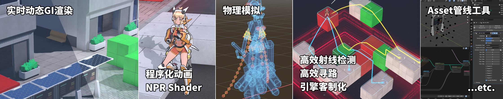

> 知识产权声明：
>
> 本项目纯属个人技术学习与算法验证（非盈利性作品集展示），绝无任何商业意图，不涉及任何形式的商业变现。
>
> 本项目内所有3D模型、纹理贴图、绑定动画及着色器代码等均由作者独立制作完成。项目中所呈现的部分角色**视觉概念、外观设计、服饰特征**等元素，其原始知识产权（包括但不限于商标权、人物形象权）完全归属于「**Project シンフォギア**」系列及其版权方。作者仅出于学习与测试NPR渲染算法等目的使用相关形象，其创作仅属于 “同人/致敬性质的艺术再创作”。作者不主张对上述角色概念的任何所有权。若原IP版权方认为此项目中的任何视觉元素侵犯了其合法权益，本人将响应版权方的正式要求，立即将该仓库设为私有或删除相关引用资源。

# 1. 图形与渲染

## 1.1. 自定义GI方案（LPV + Ray Marching）

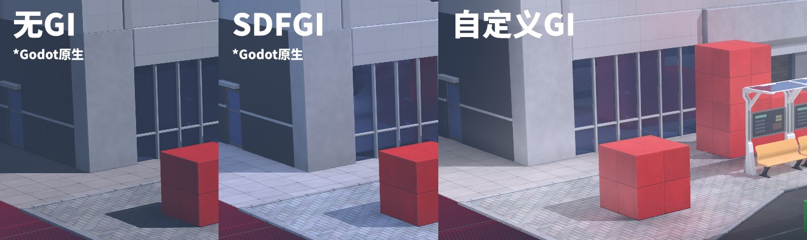
`图片：GI效果对比`

### 1.1.1. 背景

为了良好的画面表现，需要一个3D场景GI方案。计划中，游戏场景可以发生较大的动态变化，基于烘焙的方案无法适应此需求，而Godot Engine的原生动态GI（SDFGI）在此项目中的效果不理想。因此需要开发自定义GI方案。

### 1.1.2. 技术细节和效果

由于游戏地图基于3D方形网格布置，其视觉元素与网格对齐程度较好，天然跟低分辨率的体素化（voxel/volumetric）表示方式相契合。为了能在GTX1650级别的硬件上流畅运行，选用了LPV算法实现低频光照。

由于低分辨率的LPV仅能建模漫反射以及粗糙度很高的高光反射，对于较为光滑的表面，额外在LPV所使用的体素化场景中计算反射光线与体素边界的交点，从而得到锐利的镜面反射。

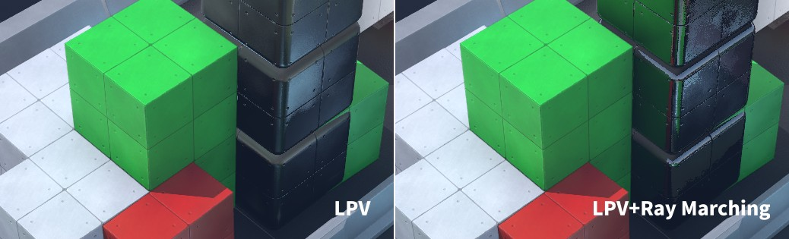
`图片：用Ray Marching补足高频光照`

使用随机采样+屏幕空间法线、深度引导的自适应低通滤波实现不同的粗糙度效果。使用高阶插值的方式消除线性插值采样LPV时的视觉artifact。为了避免漏光，在采样LPV的光照数据时使用体素化场景的遮挡信息对采样坐标进行clipping。由于多次采样性能开销较大（通过抓帧分析验证），将采样次数等参数设计成可调节的形式，可以选择不同的视觉质量-性能设置。

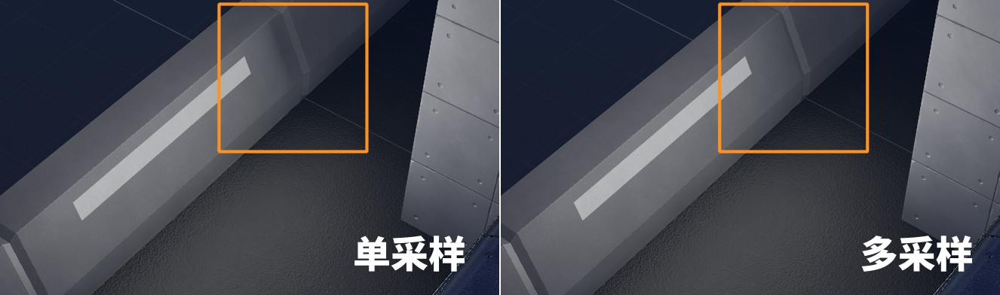
`图片：采样数量效果对比`

为减少计算量，利用Depth PrePass，在Godot引擎的Forward+渲染管线中实现类似Deferred的GI渲染逻辑。在Depth Prepass后利用所得到的粗糙度和法线信息计算无色的漫反射与高光，从而将主要的LPV采样及Ray Marching计算限制在屏幕空间。在正式对物体进行前向渲染时，直接采样已经计算好的漫反射和高光buffer，根据金属度和固有色（albedo）再进行处理与混合。

为了高效地支持动态场景，将导入到引擎的所有资产预先烘焙成体素表示，并按需上传至VRAM。LPV则运行在一个全局的体素场景中。在游戏运行时每帧收集发生变动的物体，在GPU端按需使用compute shader将各个物体的体素数据合成到全局体素场景中。同时，为了节省能耗、提高性能，仅在场景确实发生改变时才对LPV进行迭代计算，当LPV逐渐收敛时，会将LPV计算的速率逐渐降低到接近多帧一次乃至于接近于零的程度。

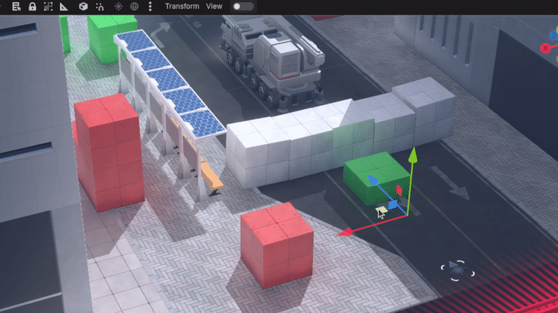
`动图：动态GI`

数据的维护使用instancing的策略，相同的物体只会在VRAM中存储一份，每一份副本仅存储instance数据（如副本在世界空间的的位姿、指向实际数据buffer的引用等）。

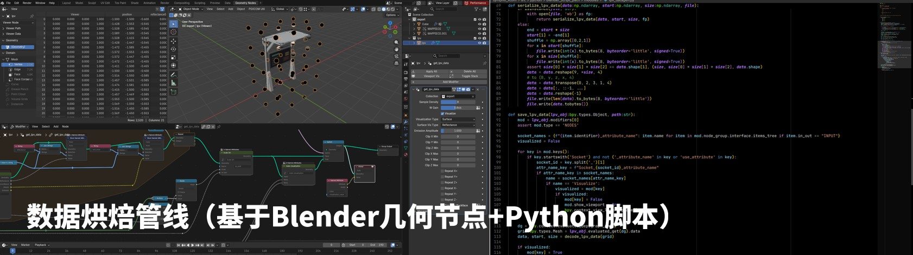
`图片：烘焙管线展示`

## 1.2. Shader

### 角色NPR渲染

实现了与动态GI联动的原理化NPR着色器。核心策略是在Lambert和GGX基础之上进行Color Ramp处理：

- GI联动逻辑：不直接使用LPV的绝对亮度（避免阴影与绝对亮度绑定），而是计算LPV的一阶微分推导主光源方向，以此确定动画风格的硬边阴影分割。

- 物理参数存储：粗糙度、金属性、各项异性高光切线等数据存储在顶点属性中，配合资产管线工具实现高效美术迭代。

- 描边方案：采用经典的 Backface Culling + 法线膨胀法，根据顶点数据和摄像机距离调整粗细。

### 场景PBR优化

为降低Drawcall、减少资产制作的美术负担：

- 使用 顶点色 + Triplanar Mapping 替代传统UV贴图，免去手动展UV的负担。

- 整合多组贴图为 Texture Array，允许单一材质下不同Mesh部分调用不同质感贴图，大幅减少材质实例数量。

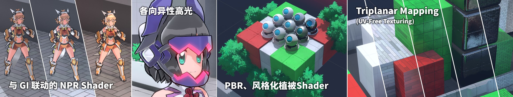
`图片：Shader效果展示`

# 2. 底层优化、物理模拟与引擎客制化

## 2.1. 地图数据结构、高效物理检测与寻路系统

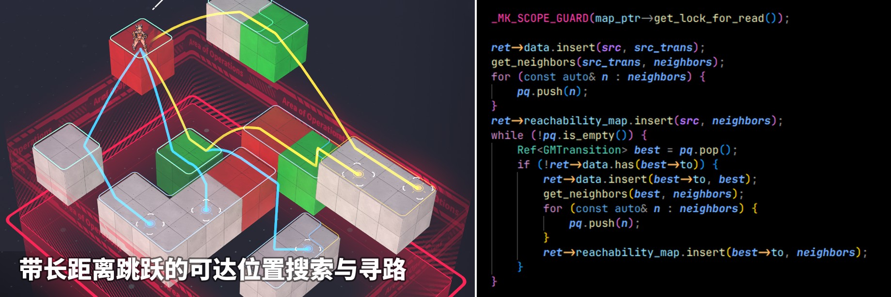
`图片：带长距离跳跃的批量寻路`

### 2.1.1. 背景

战棋游戏的地图是网格结构，Godot引擎本身针对寻路、物理检测等任务提供的通用解决方案无法高效地处理这一逻辑。而游戏设计上决定赋予角色以更强的机动性，使其能够沿抛物线在网格地图中进行长距离跳跃、从高处下落等等。同时，游戏需要兼容不同体型（即占地面积是不同格子数量）的角色。这些因素使得可达位置搜索与寻路的难度随之增高，脚本语言和通用解决方案已经难以满足任务的性能需求。因此，使用C++编写了更加高效、紧凑的数据结构及相应的射线检测和寻路算法等，在脚本层面仅暴露高层次的API，以提升性能。

### 2.1.2. 技术细节和效果

网格结构的地图与稠密的3D数组天然对应，并且数组的缓存性能通常比其它结构更优。但为了实现视觉上比网格更加精细的足部IK（详情后述）等效果，又需要维护高于网格体分辨率的碰撞信息。最终采用方案是，仅使用稠密的数组记录少量用以加速寻路算法的数据（当前格子是否能够作为角色的落脚点、从当前位置落下后的落点等）。而构成地图的各个物体或组件则使用Spatial Hashing的方式与空间位置建立平均O(1)的双向映射。具体而言，地图会维护两张哈希表，其一负责根据网格地图的坐标查询所有与该位置有接触的物体；其二记录各个物体在地图上占用的位置。这一结构（或者说spatial indexer）主要用于快速定位附近物体、提供快速且有效的broad phase查询。

为了实现抛物线跳跃轨迹的可行性判断、足部IK自动接地、物理动画与场景碰撞等功能，需要实现多种射线检测算法，包括基础的射线检测、sphere sweep等。所实现算法的基本逻辑是：在地图中以网格为单位进行Ray Marching，利用已经建立的spatial indexer快速定位可能的碰撞体，然后逐一进行检测。

考虑到实现复杂度和计算性能的原因，不使用mesh作为碰撞体，而是全部使用primitive shape来搭建碰撞体积。为了方便编辑，除了常见的球、胶囊、立方体等形状之外，还提供了若干种较为复杂的碰撞体形状，如多级阶梯、带倒角的圆柱、圆环、棱柱等等。其中，最简单的形状使用解析方法直接求解碰撞；而较为复杂的形状则通过SDF Tracing来实现。这样实现的好处之一在于，即使是较为复杂的形状，也能够十分方便且高效地支持sphere tracing（因为对SDF进行简单的偏移即可得到原始形状与球体的闵可夫斯基和，从而将问题转化为普通的射线检测）。

这一实现剔除了与所需任务不相关联的物理逻辑、利用spatial hashing能够无视场景尺度高效地完成broad phase碰撞体筛选、并且通过针对性的设计高效支持sphere tracing而不依赖通用的求解算法（GJK-EPA）。通过针对性的优化，该实现在本项目的应用场景下能够取得远高于Godot原生实现的性能。

| 物理方案 | Godot Physics（Godot旧引擎） | Jolt Physics（Godot新引擎） | 自定义方案 |
| --- | --- | --- | --- |
| raycast速度 | 100% | 142% | **232%** |
| sphere sweep速度 | 100% | 88% | **6923%** |

寻路算法方面，主要使用Dijkstra。不显式地维护图结构，而是在算法需要获取邻接节点时从地图中利用高效率的raycast等快速检测各个方向上是否能够行走、是否能够进行远距离跳跃等等。

> Q-为什么不用A*或NavMesh之类的方案？
>
> A-因为我们需要收集所有可到达的位置，并计算到每一个位置的最短路径。换言之，我们需要的是Dijkstra路径cost小于一定值的的整个搜索空间。而`A*`和NavMesh都是针对点对点最短路径搜索的算法。特别地，`A*`实质上是通过额外的距离估计信息减小了Dijkstra的搜索空间，而NavMesh则难以优雅地实现远距离跳跃等逻辑。对于本项目的任务而言，Dijkstra是更加合适和高效的方案。

## 2.2. 程序化动画（Verlet物理模拟、足部IK自动接地等）

※ 游戏内物理模拟为60fps，以下图片帧率受动图格式和体积限制，不如游戏内流畅

`动图：物理和足部IK效果展示`

### 2.2.1. 背景

Godot引擎原生的SpringBoneSimulator无法处理复杂布料（披肩），且长丝带易发生不稳定的震荡。通用物理引擎则以mesh顶点为单元进行计算，计算量大且对美术资源制作有特殊要求。为此，自研基于骨骼的物理系统，以骨骼为模拟单元，实现轻量化物理计算（单角色仅需 0.2~0.4ms）。

另外，项目的3D场景中可能包含不平整的地面、阶梯等元素，且角色的朝向是任意的。固定的动画难以达到理想的视觉效果，并且制作费时。因此开发了自动根据朝向变化与地形碰撞信息动态调整角色腿部和躯干动作的算法。

### 2.2.2. 技术细节和效果

物理模拟方案基于Verlet积分框架：以骨骼为模拟单元，利用显式弹簧力建模布料/丝带的连接关系，并在每一帧积分后直接将粒子位置投影至碰撞体边界以处理碰撞与自碰撞。以骨骼而非mesh顶点作为模拟的单元，降低计算量，并且使得模拟精度与mesh复杂度解耦，提供更大的资产制作自由度。使用弹簧质点模型建模布料和丝带。

- 针对经典的胡克弹簧+drag难以建模轻巧而没有弹性感的材料的问题，向弹簧中添加了一阶微分控制器，在保持快速响应的同时抑制超调，从而减少“弹性”的感觉。
- 针对大动作/快速运动容易穿模的问题，添加了edge-collision、将碰撞导致的位置变化向相邻的节点传导、在动作过快时将部分骨骼动画导致的运动直接注入物理模拟，保证不出现过于极端的物理变形。
- 针对过长丝带容易不稳定的问题，在根部和尖端两个方向上使用了不同强度的约束，让运动倾向于从根部往尖端传导，从而维持良好、稳定的飘动和轻便感。
- 各个角色的物理单独计算，且可以以角色为单位并行计算。单个角色单帧的物理逻辑通常仅需0.2~0.4ms（取决于造型设计的物理复杂度）即可完成计算，可充分利用现代多核处理器的计算力，能够支持大量角色的复杂物理效果模拟。

足部IK使用2-bone IK闭式求解，无需迭代优化计算。使用有限状态机维护自动抬腿、转身的逻辑，在实际落脚点与动画误差过大时自动生成小幅移步的动画。利用2.1.中实现的高效sphere sweep算法来搜索合适的落脚点，并确定地形高度、朝向等。仅需单一的idle动画即可生成合理的转身等程序化动画。

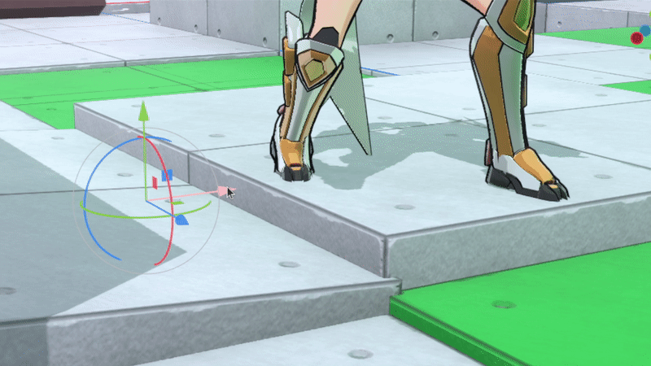
`动图：足部IK效果`

## 2.3. 引擎客制化与社区贡献

为了高效实现项目中的NPR Shader，需要向Godot的渲染管线中添加新的自定义逻辑注入点——具体而言，NPR Shader需要在光照计算完成后读取合并后的光照信息，从而生成干净的赛璐珞风格渲染。详情参见[PR113200](https://github.com/godotengine/godot/pull/113200)及[客制化版本仓库](https://github.com/HEX-23/godot-NPR/tree/npr-4.6)。（※由于架构限制，Godot的Compatibility渲染器无法100%地实现此功能，仅能在Forward+（本项目所使用的渲染器）与Mobile渲染器上实现。此特性目前仅是特定于任务需求的客制化，而未整合到上游仓库中）

另外，为了实现高性能的动画逻辑处理等，本项目将不同角色的动画分散到不同线程上进行计算。使用引擎相关功能时发现并解决了若干由race condition导致的恶性漏洞。另有修复关于SSR（屏幕空间反射）渲染的视觉方面漏洞等。详情请参考[PR116192](https://github.com/godotengine/godot/pull/116192)、[PR115904](https://github.com/godotengine/godot/pull/115904)、[PR116012](https://github.com/godotengine/godot/pull/116012)、[PR116000](https://github.com/godotengine/godot/pull/116000)等。

# 3. 综合开发（Gameplay / DCC工具链 / 资产制作）

尽管本项目侧重底层技术验证，本人亦独立完成了其它开发环节：包含Gameplay逻辑开发、UI、模型和贴图资产制作、资产管线自动化工具开发等等。本节仅概略展示相关工作成果：

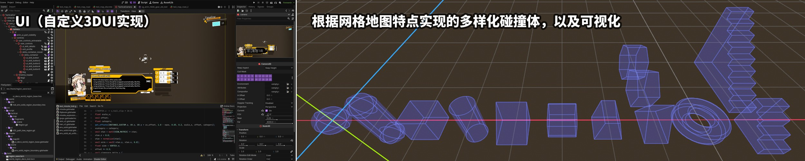
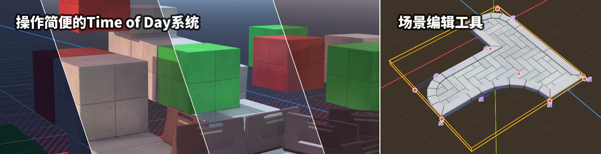
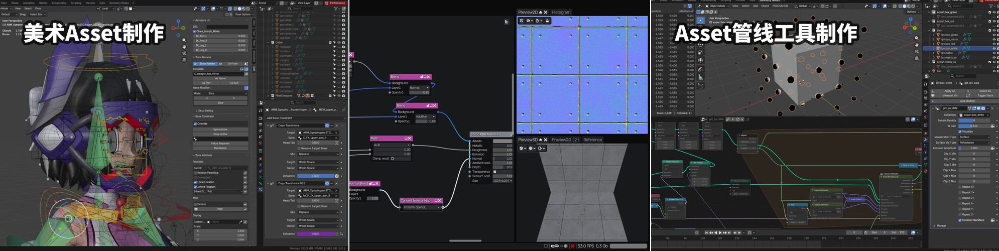
